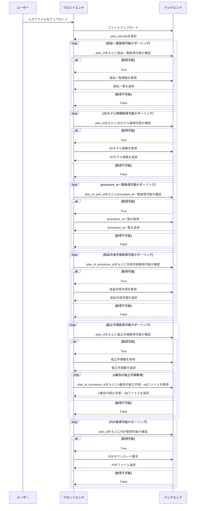

# 基本設計書

## 1. システム概要

本アプリ「CraftMate AI」は、ユーザーが画像（完成イメージ）をアップロードし、画像内の部品を自動検出・リスト化し、各部品の3Dモデル情報や部品作成手順、組み立て手順を取得・表示するWEBアプリケーション。組み立て手順ごとに3Dモデルを描画し、ユーザーが視覚的に手順を確認でき、初心者でもDIYを気軽にはじめることができることを目的とする。

## 2. 機能一覧

1. 画像アップロード機能
   - ユーザーが画像ファイル（例：jpg,jpeg,png）をアップロードできる。
2. 部品一覧表示機能
   - アップロード画像から部品を自動検出し、部品名をリスト表示。
3. 3Dモデル情報表示機能
   - 各部品の3Dモデルデータ（.obj）を取得し、表示する。
     - 部品リストの部品名をクリックすると、3Dモデル中の部品がハイライトされることが望ましい。
4. 部品作成手順表示機能
   - 各部品の作成手順を表示する。
5. 組み立て手順・3Dモデル描画機能
   - 組み立て手順をステップごとに表示し、各手順完了時の3DモデルをWeb上で描画。
   - 「前へ」、「次へ」ボタンで手順・3Dモデルを移動することができる。
6. 設計書PDFダウンロード機能  
   - 必要な部品と作成手順、部品の組み立て手順をまとめたPDFをダウンロードボタンを押すとダウンロードすることができる
7. ユーザー認証機能 (フロントエンドで実装)
    - Googleアカウントでのログインを実装する。
    - ユーザーの認証状態を管理し、ログイン後に機能を利用可能にする。
    - 過去のアップロード履歴を管理し、ユーザーごとに部品一覧や3Dモデル情報を保持し、再度表示できるようにする。(できたらやる)

## 3. 画面設計（主要画面）

- ログイン画面：Googleアカウントでのログイン
- トップ画面：画像アップロードUI、部品一覧表示、3Dモデル表示、部品作成手順作成、組立手順表示

## 4. システム構成

- フロントエンド：Flutter, Three.js等で実装
- バックエンド：Flask、内部でAIエージェントを使用
- ストレージ：Cloud Storage(3Dモデル情報等)
- 認証：Identity-Aware Proxy

## 5. データフロー

以下は主要な機能のデータフローを示すシーケンス図。

